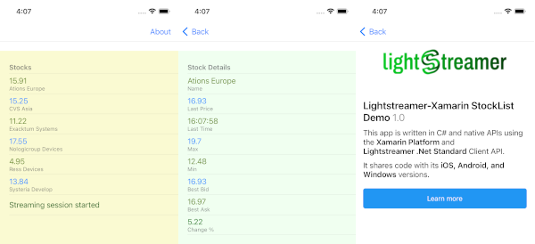

# Lightstreamer -Basic Stock-List Demo - Xamarin Client

<!-- START DESCRIPTION lightstreamer-example-stocklist-client-javascript-basic-stock-list-demo---electron-client -->

This project contains a demo application showing the integration between the [Lightstreamer .Net Standard Client](https://lightstreamer.com/api/ls-dotnetstandard-client/latest/) library and [Xamarin](https://docs.microsoft.com/it-it/xamarin/) cross-platform mobile application development tool.

 

## Details

This demo displays real-time market data for six stocks generated by a feed simulator and is based on [Basic Stock-List Demo](https://github.com/Lightstreamer/Lightstreamer-example-StockList-client-javascript#basic-stock-list-demo---html-client). 
This project shows how is it possible to integrate the <b>.Net Standard Client API for Lightstreamer</b> into a <b>Xamairn</b> project, in order to quickly create cross-platform mobile apps embedding real-time technologies.

<!-- END DESCRIPTION lightstreamer-example-stocklist-client-javascript-basic-stock-list-demo---electron-client -->

### Dig the Code

* `App.xaml` (and `App.xaml.cs`) is the main application file; it contains application events handling code (application start, sleep, resume, etc.).
* `MainPage.xaml` (and `MainPage.xaml.cs`) is the main page of the app. Consists in a simple table containing the last price of six stocks updated in real-time (simulated); clicking or tapping into one of them open the Details page.
* `DetailsPage.xaml` (and `DetailsPage.xaml.cs`) is the Details page of the app and contains details info of a stock (Name, Last Price, Last Time, Max, Min, Best Bid, Best Ask, Change %), also all these informations are real-time updated.
* `AboutPage.xaml` and (`AboutPage.xaml.cs`) is tha About page and contains a brief intoduction to the demo.
* `RTFeed.cs` class acts as a bridge between the pages and the Lightstreamer Client library, in order to subscribe the necessary Items and collect all updates in real time. Indeed this class is used as BindingContext for the viusal Xamarin widgets.
This class also takes care of opening and closing the connection to the Lightstreamer server.
* `TestConnectionListener.cs` this class implements the [ClientListener](https://lightstreamer.com/api/ls-dotnetstandard-client/latest/api/com.lightstreamer.client.ClientListener.html) interface of Lightstreamer Client API, and receives all the information about changes in the status of the connection with the Lightstreamer server.
* `QuoteListener.cs` and `DetailsListener.cs` implement the [SubscriptionListener](https://lightstreamer.com/api/ls-dotnetstandard-client/latest/api/com.lightstreamer.client.SubscriptionListener.html) interface of Lightstreamer Client API, and receives the reale time updates for the Items subscribed.

  
Check out the sources for further explanations. 

<i>NOTE: Not all the functionalities of the Lightstreamer .NET Standard Client Library are exposed by the classes listed above. You can easily expand those functionalities using the .NET Standard Client API as a reference. 
If in trouble, check out the [Lightstreamer forum](https://forums.lightstreamer.com/).</i> 

## Build 

To build your own version of the demo follow these steps:

* Import the source codes of this project in a Viusual C# Cross-Platform project (Xamarin.Forms). We have used the Visual Studio 2017 and you can download it from the [Microsoft website](https://visualstudio.microsoft.com/en/xamarin/). 
* You can choose the target devices between iOs, Androin and UWP.
* You should complete this project with the <b>Lightstreamer .NET Standard Client</b> library, to be used for the build process, trough NuGet. Follow these steps:
	* In the "Solution Explorer" tab, right click on the project and choose `Manage NuGet Packages ...`
	* In the Search text box enter `Lightstreamer`
	* Choose <b>Lightstreamer.DotNetStandard.Client</b> then click `Install` and then `Ok`
* You may run the demo against your local server or using our online server `push.lightstreamer.com`. The server to which the demo will connect to is configured in the `RTfeed.cs` file; by default the demo targets our demo server at https://push.lightstreamer.com. 
	* In the former case, note that, as prerequisite, the [Lightstreamer - Stock- List Demo - Java Adapter](https://github.com/Lightstreamer/Lightstreamer-example-Stocklist-adapter-java) has to be deployed on your local Lightstreamer Server instance. Please check out that project and follow the installation instructions provided with it.
* Launch the Debug choosing your preferred platform and enjoy.

## See Also

### Lightstreamer Adapters Needed by This Demo Client

<!-- START RELATED_ENTRIES -->
* [Lightstreamer - Stock-List Demo - Java Adapter](https://github.com/Lightstreamer/Lightstreamer-example-Stocklist-adapter-java)
* [Lightstreamer - Reusable Metadata Adapters- Java Adapter](https://github.com/Lightstreamer/Lightstreamer-example-ReusableMetadata-adapter-java)

<!-- END RELATED_ENTRIES -->

### Related Projects

* [Lightstreamer .NET Standard Client SDK](https://github.com/Lightstreamer/Lightstreamer-lib-client-dotnet)
* [Lightstreamer - Stock-List Demos - HTML Clients](https://github.com/Lightstreamer/Lightstreamer-example-Stocklist-client-javascript)
* [Lightstreamer - Basic Stock-List Demo - jQuery (jqGrid) Client](https://github.com/Lightstreamer/Lightstreamer-example-StockList-client-jquery)
* [Lightstreamer - Basic Stock-List Demo - Electron Client](https://github.com/Lightstreamer/Lightstreamer-example-StockList-client-electron)
* [Lightstreamer - Basic Stock-List Demo - Java SE (Swing) Client](https://github.com/Lightstreamer/Lightstreamer-example-StockList-client-java)
* [Lightstreamer - Basic Stock-List Demo - .NET Client](https://github.com/Lightstreamer/Lightstreamer-example-StockList-client-dotnet)

## Lightstreamer Compatibility Notes 

* Compatible with Lightstreamer .NET Standard Client Library version 5.0.0 or newer.
* Ensure that .Net Standard Client API is supported by Lightstreamer Server license configuration.
* For instructions compatible with .NET Standard Client library version 4.x, please refer to [this tag](https://github.com/Lightstreamer/Lightstreamer-example-StockList-client-Xamarin/tree/for_client_4.x).

